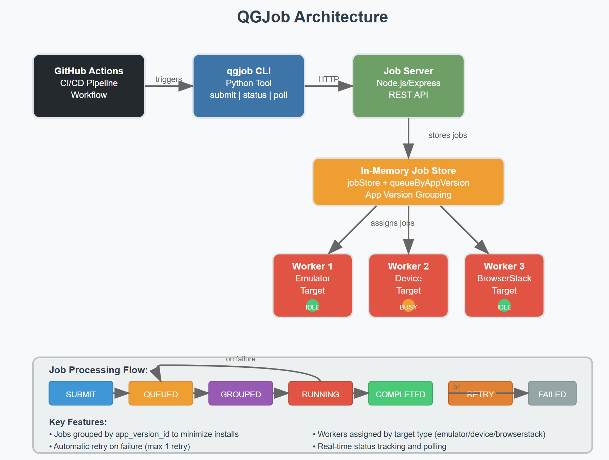

QGJob - AppWright Test Queue and Deployment CLI
A CLI tool and backend service for queuing, grouping, and deploying AppWright tests across local devices, emulators, and BrowserStack with GitHub Actions integration.
Architecture Overview
┌─────────────────┐    ┌──────────────────┐    ┌─────────────────┐
│   GitHub Actions │    │    qgjob CLI     │    │   Job Server    │
│    Workflow      │───▶│    (Python)      │───▶│   (Node.js)     │
└─────────────────┘    └──────────────────┘    └─────────────────┘
                                                         │
                                                         ▼
                                                ┌─────────────────┐
                                                │   In-Memory     │
                                                │   Job Store     │
                                                │  & App Version  │
                                                │   Grouping      │
                                                └─────────────────┘
                                                         │
                                                         ▼
                                                ┌─────────────────┐
                                                │  Worker Pool    │
                                                │  - Emulator     │
                                                │  - Device       │
                                                │  - BrowserStack │
                                                └─────────────────┘

Components
1. qgjob CLI Tool (Python)

Purpose: Submit and monitor test jobs
Commands:

submit: Submit a new test job
status: Check job status
poll: Poll until job completion

2. Job Server (Node.js)

Purpose: Job orchestration and worker management
Features:

Job queueing and storage
App version grouping
Worker assignment
Retry logic
Status tracking

3. GitHub Actions Integration

Purpose: CI/CD integration for automated testing
Features:

Automatic job submission
Health checks
Build failure on test failure

Setup Instructions
Prerequisites

Node.js (v18+)
Python (v3.10+)
npm

Local Development Setup

Clone the repository
bashgit clone <repository-url>
cd qgjob

Install server dependencies
bashnpm install express uuid cors

Install Python dependencies
bashpip install requests

Start the job server
bashnode server.js
The server will start on http://localhost:3000
Verify server is running
bashcurl http://localhost:3000/health

How Grouping/Scheduling Works
Job Grouping by App Version

Submission: Jobs are submitted with an app_version_id
Grouping: Jobs with the same app_version_id are grouped together in queueByAppVersion
Scheduling: The scheduler processes jobs from the same app version sequentially on the same worker
Efficiency: This minimizes app installation overhead by reusing the same app version across multiple tests

Worker Assignment

Worker Pool: 3 simulated workers (emulator, device, browserstack)
Target Matching: Jobs are assigned to workers based on their target type
Availability: Only idle workers can accept new jobs
Retry Logic: Failed jobs are retried once before being marked as failed

Scheduling Algorithm
javascript// Simplified scheduling logic
for (const worker of workerPool) {
  if (worker.busy) continue;
  
  // Find queued job for this worker's target
  for (const app_version_id in queueByAppVersion) {
    const queue = queueByAppVersion[app_version_id];
    const jobId = queue.find(jid => {
      const job = jobStore[jid];
      return job.status === 'queued' && job.target === worker.target;
    });
    // Assign job to worker...
  }
}

Usage
CLI Commands
Submit a Test Job
bashpython qgjob.py submit \
  --org-id=qualgent \
  --app-version-id=xyz123 \
  --test=tests/onboarding.spec.js \
  --priority=high \
  --target=emulator
Check Job Status
bashpython qgjob.py status --job-id=abc456
Poll Until Completion
bashpython qgjob.py poll --job-id=abc456
API Endpoints

POST /jobs - Submit a new job
GET /jobs/:job_id - Get job status
GET /jobs - List all jobs
GET /health - Health check

End-to-End Test Submission
Manual Test Flow

Start the server
bashnode server.js

Submit a job
bashpython qgjob.py submit --org-id=testorg --app-version-id=v1.0 --test=tests/login.spec.js --target=emulator

Check status
bashpython qgjob.py status --job-id=<returned-job-id>

Poll for completion
bashpython qgjob.py poll --job-id=<returned-job-id>

Expected Flow

Job is submitted and receives a unique ID
Job is queued and grouped by app version
Available worker picks up the job
Job status changes: queued → running → completed/failed
Failed jobs are retried once

GitHub Actions Integration
The workflow automatically:

Starts the job server
Verifies server health
Submits a test job
Monitors job completion
Fails the build if tests fail

Scalability Considerations
Current Implementation

In-memory storage (development/testing)
Single server instance
Simulated worker pool

Production Enhancements

Replace in-memory storage with Redis/PostgreSQL
Add horizontal scaling with load balancers
Implement distributed worker management
Add metrics and monitoring
Implement job persistence and crash recovery